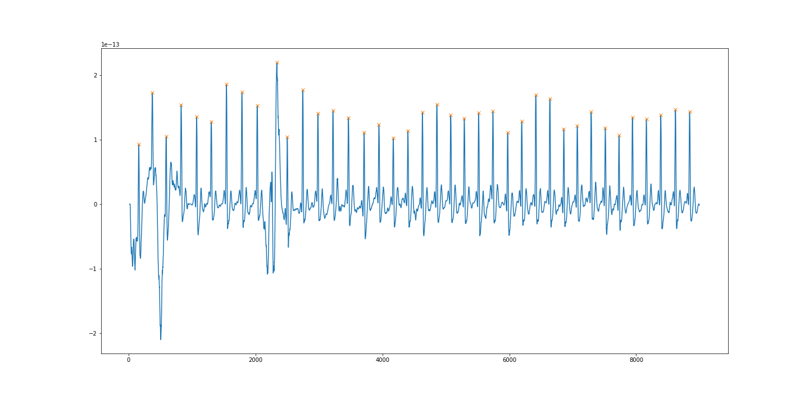

# 機械学習の決定木による心房細動の検出
<html lang="JP">
<h1>概要</h1>
  
2017年のPhysioNetの心電図のデータセットを使用して決定木による心房細動を検出をする。

  <a href="https://physionet.org/content/challenge-2017/1.0.0/" target="_blank">AF Classification from a Short Single Lead ECG Recording - The PhysioNet Computing in Cardiology Challenge 2017:データセットのリンク先</a>
  
このデータセットは4つのラベルがあり、30〜60秒の短時間の心電図が記録されている。
  正常心電図であっても体動などの雑音があり、デジタルフィルタでの除去が必要になる。
  心電図にはR波と呼ばれる心室の興奮を表す波形があり、これは心臓が「ドキンドキン」と拍動していることを表している。
  R波と次のR波の間隔を心拍間隔（RRI）と呼び、これを心拍変動解析（HRV）によって時間領域分析や周波数領域分析することにより
  不整脈の特徴量となる統計量を得ることができる。
   
  今回は時間領域分析を行いRRIの標準偏差であるSDNNなどを計算し、これらを特徴量としてscikit-learnの決定木による分類を行う。
    決定木は多クラス分類を行いやすく、参考文献でもストレスに対する判定がであるが、心電図へのモデルとして優秀な結果が出ている（AUC:94%）。
  周波数領域分析は2分以上のデータでなければ正確な値にならないので今回は除外する

   
  <h3>参考文献</h3>
  <ul>
  <li><a href="https://www.ncbi.nlm.nih.gov/pmc/articles/PMC5260487/" target="_blank">Cardiac Autonomic Dysfunction and Incidence of Atrial Fibrillation in a Large Population-Based Cohort</a></li>
   
  <li><a href="https://www.ncbi.nlm.nih.gov/pmc/articles/PMC6335694/" target="_blank">Ultra-short term HRV features as surrogates of short term HRV: a case study on mental stress detection in real life</a></li>
  </ul>
  
<h1>背景</h1>
  
日本循環器学会の心房細動治療ガイドライン2013によれば、日本では71.6万人の患者おり、2050年には103万人達すると言われている。
  また、アメリカ、EUにおいてもそれぞれ230万人（2013）、880万人（2010）と多数の患者いる。
   
  心房細動は心臓の上部（心房）が200〜300回程度小刻みに拍動するが、心臓の下部（心室）は通常の拍動をしようとし、心房と心室でギャップが生じることで血液の流れが悪くなり、特に心臓の左上部の左房で血栓が生じ、この血栓が脳に至ると脳塞症を引き起こす。また、合併症として心不全もある重要度が高い疾患である。
   
  下図はデータセットに含まれる波形でそれぞれ
  <ul>
    <li>Nomal rhythm:正常心電図
     
    正常心電図でも体動による雑音が混入したりする。心拍数は60〜80程度である。
    </li>
    <li>AF rhythm:心房細動
     
    心房細動は心拍間隔（RRI）が一定でなく、臨床的に痙攣のような拍動をしているので、RRIの標準偏差であるSDNNはバラつきやすい。
    </li>
    <li>Other rhythm:その他不整脈
     
    この例で出されているのは心室性期外収縮であるが、今回は分類対象として細分化することはせずに、
    その他不整脈として扱う。</li>
    <li>Noisy recording:雑音成分が多すぎる波形
     
    雑音は筋電図の混入や交流電源などにより発生する。これが今回のデータセットのなかでも厄介な存在になる。
    </li>
  </ul>
  

  
  <h3>参考文献及びサイト</h3>
  <ul>
  <li><a href="https://www.j-circ.or.jp/old/guideline/pdf/JCS2013_inoue_h.pdf" target="_blank">心房細動治療（薬物）ガイドライン（2013年改訂版）</a></li>
   
  <li><a href="https://www.cardiac.jp/view.php?lang=ja&target=af_af.xml" target="_blank">ハート先生の心電図教室</a>    </li>
  </ul>

<h1>主な使用ライブラリ</h1>
  <ul>
    <li>numpy</li>
    <li>pandas</li>
    <li>scipy</li>
    <li>scikit-learn</li>
    <li>matplotlib</li>
  </ul>

<h1>前処理</h1>
  
生の心電図波形には雑音が生じており、scipyのデジタルフィルタを活用し除去していく。
   
  生体信号は1~2mVの微弱な電位であるので、直流電流により増幅されている。
  scipyのbetrendにより除する
  
   
  生の心電図、波形の歪んでいる部分は体動によるノイズだと思われる。この場合は正常心電図である。
   
  
   
  直流成分を取り除いたことで生の心電図に電位を得る。
   
  
   
  直流成分を取り除いた波形に対してバンドパスフィルタをかけることで、心電図の周波数である0.05〜100Hz以外の信号を減衰させる。
   
  ブルーの波形が直流成分を取り除いたもの
   
  オレンジがバンドパスフィルタをかけたもの
   
  
   
  バンドパスフィルタ後の波形に対して、移動平均をかけることで、雑音成分の電位を減衰させる。
   
  ブルーの波形がバンドパスフィルタをかけたもの
   
  オレンジが移動平均をしたもの
   
  
   
  移動平均後の波形に対してR波のピークを検出し、これの差をRRIとして得る。
   
  このとき微小雑音を拾わないように0.4秒待機してから次を検出するとともに
  検出最低電位を設定した。RRIが0.4秒は心拍数＝60/0.4=150拍であるので、この心拍数は心房細動しては早すぎて、
  心室細動などの致死的な不整脈が発生している場合が考えられるので、今回は心房細動がターゲットのため、このような設定にした。
   
  オレンジの✖印が検出を表す。
   
  
   
  RRIデータに対して解析を行う
   
  ここまでの処理は
  <ul>
    <li>hrv_analysis_TrainData.ipynb</li>
    <li>hrv_analysis-TestData.ipynb</li>
  </ul>
   
  上記で行っているので、詳しくはこちらを参照
   
  また、ラベル付は
   
  <ul>
    <li>add_label_DataFrame_Training.ipynb</li>
    <li>add_label_DataFrame_Test.ipynb</li>
  </ul>
   
  上記を参照
  

  
<h1>学習と結果</h1>
  
結論から言うと交差検証の結果の平均は0.645
   
  テストデータへのスコアは0.57とかなり悪いものとなってしまった。グリッドサーチによる最適パラメータにより決定木の深さを決めたりなど、
工夫を凝らしたが、雑音波形への対応が全くできていなかったのが、浮き彫りになった。
   
  以下混同行列の結果をまとめて示す。
  
  

